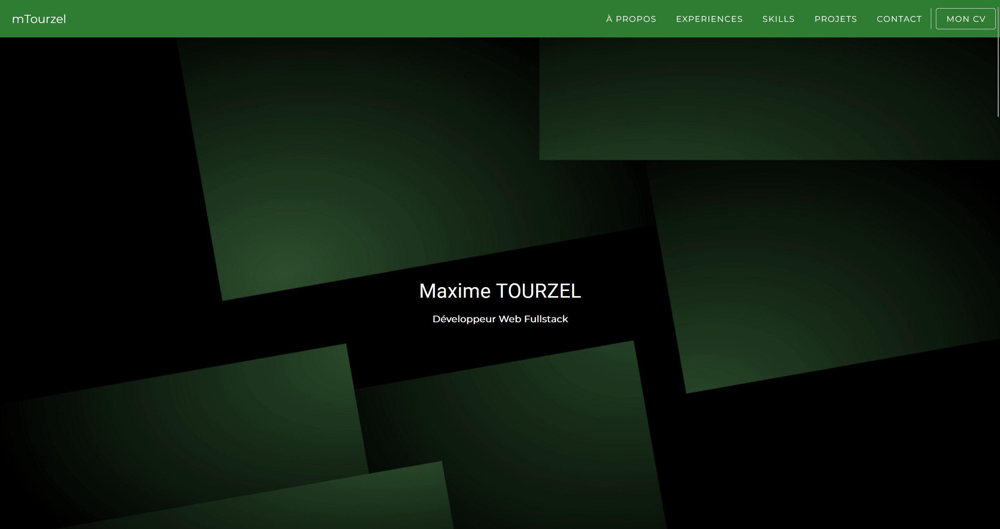

# Personal Portfolio

Ce projet est un portfolio personnel développé avec **Nuxt 3** et **Vuetify**. Il présente mes expériences, mes compétences, mes projets...

Le site est accessible ici : https://maximetourzel.github.io/personal-portofolio/



## Aperçu

Le portfolio comprend plusieurs sections :

- **À propos de moi** : Une brève description de mon parcours et de mes compétences.
- **Expériences** : La timeline de mes expériences professionnelles.
- **Projets** : Une présentation des projets avec liens vers GitHub.
- **Compétences techniques** : Une liste des technologies que je maîtrise (Frontend, Backend, Outils DevOps, etc.).
- **Contact** : Les informations pour me contacter.

## Technologies utilisées

- **Nuxt 3** : Framework de développement pour Vue.js, optimisé pour la génération statique.
- **Vuetify 3** : Bibliothèque de composants UI Material Design.
- **SCSS** : Pour la gestion des styles.

## Installation

Clonez le dépôt sur votre machine locale :

```bash
git clone https://github.com/maximetourzel/personal-portfolio.git
cd personal-portfolio
```

Installez les dépendances :

```bash
npm install
```

## Utilisation

### En développement

Lancez le projet en mode développement avec Hot Module Replacement :

```bash
npm run dev
```

Le site sera disponible à l'adresse http://localhost:3000

### Génération de la version statique

Pour générer une version statique du site, exécutez :

```bash
npm run generate
```

Les fichiers statiques seront générés dans le dossier ``dist``

### Prévisualisation de la version statique

```bash
npm run preview
```
